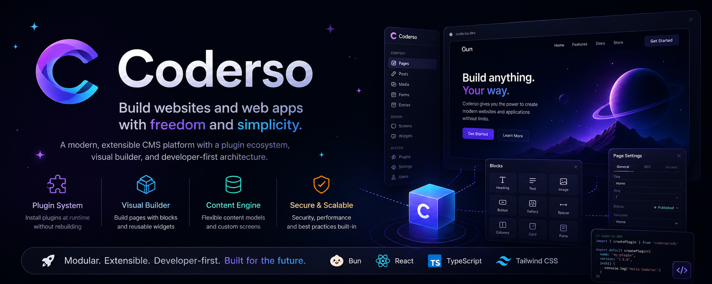

<p align="center">
  
</p>

<p align="center">
  <strong>The modern, AI-native alternative to WordPress.</strong>
</p>

<p align="center">
  Build real websites, content systems, and business apps — visually, with structured data underneath
  <br />
  and a built-in AI assistant that helps you set it all up.
  <br />
  <em>Simple on the surface. Powerful underneath. No rebuilds to ship a change.</em>
</p>

<p align="center">
  <a href="#-why-coderso">Why Coderso</a>
  ·
  <a href="#-coderso-vs-wordpress">vs WordPress</a>
  ·
  <a href="#-features">Features</a>
  ·
  <a href="#-the-ai-assistant">AI Assistant</a>
  ·
  <a href="#-quick-start">Quick Start</a>
  ·
  <a href="#-documentation">Docs</a>
</p>

<p align="center">
  
  
  
  
  
</p>

---

## 👋 What is Coderso?

**Coderso** is a modular web platform with the everyday simplicity of WordPress and the architecture
of a modern, developer-first app. You get pages, posts, media, menus, forms, SEO, and a visual
builder out of the box — plus a content engine, business modules, runtime plugins, and a built-in
**AI assistant** that can guide setup and even make changes for you.

It is designed to **start simple**…

- create pages and posts,
- manage media,
- build forms,
- configure menus and SEO,
- publish — instantly.

…and **grow without limits**:

- custom content models for real business data,
- reusable widgets and templates,
- listings, search, booking, reviews, and commerce,
- runtime plugins installed without rebuilding the app,
- one-click **Solution Kits** for whole verticals,
- an AI assistant that plans and applies changes.

> Coderso is pronounced **ko-der-so** — *Code + Resources*, *Code + Orchestrator*.

---

## ✨ Why Coderso

### 🤖 AI-native, not AI-bolted-on
Most platforms staple a chatbot on top. Coderso ships an assistant that actually **understands the
product** and can **execute typed, reviewable actions** (create a content type, build a page, set up a
form) through a safe `plan → dry-run → review → execute → validate` flow. It works **with no API key
at all** thanks to a built-in documentation engine — and gets supercharged when you plug in your own
LLM provider.

### ⚡ Change things live — no rebuilds, no downtime
Editing content, settings, menus, themes, security policy, or installing a plugin **never requires a
server restart or a rebuild**. It's the fast, edit-and-refresh feel of classic PHP — but with a modern,
typed, validated runtime. You only rebuild when you change the core source itself.

### 🧱 Visual on top, structured underneath
Compose pages from reusable **widgets** with a visual builder, while everything stays as clean,
validated, structured data. Non-technical users build comfortably; developers keep guarantees.

### 🔌 Extend without forking
A **runtime plugin system** lets you ship extensions as prebuilt bundles — installed, upgraded, and
rolled back live. A dedicated **store** workspace adds curation and security scanning on top.

### 🛡️ Secure and tested by default
Schema-first validation, RBAC, CSRF, rate limiting, encrypted secrets, audit logs, and built-in
security scanners (Semgrep, Trivy, Gitleaks) plus release gates — baked into the workflow, not an
afterthought.

---

## 🥊 Coderso vs WordPress

| | **WordPress** | **Coderso** |
|---|---|---|
| Core language / runtime | PHP | **Bun + TypeScript**, end-to-end typed |
| Admin UI | Server-rendered + jQuery legacy | **React 19 + Tailwind**, modern SPA admin |
| Content modeling | Plugins (ACF, etc.) | **Built-in content engine** (custom types, entries, screens) |
| Page building | Plugin-dependent (Elementor/Gutenberg) | **Native visual builder** with validated widget data |
| Data integrity | Loosely-typed meta tables | **Schema-first**, validated, normalized |
| Extending | Plugins (often need rebuild/cache flush) | **Runtime plugins** — install/upgrade/rollback live |
| AI | Third-party add-ons | **Native assistant** (docs-only or LLM-powered) |
| Business modules | Many separate plugins | **Forms, Listings, Booking, Reviews, Commerce, Popups** in one place |
| Verticals | DIY or premium themes | **Solution Kits** — one-click setups |
| Security | Plugin sprawl, frequent CVEs | **Hardened core** + scanners + release gates |
| Restart to apply changes | Rarely (but cache/plugin chaos) | **Never** for content/config/plugins |

> Coderso isn't trying to *be* WordPress. It's what a content platform looks like when you design it
> today — for creators, operators, **and** developers.

---

## 🧩 Features

### Publish (familiar, fast)
- **Pages** with draft/published workflow, revisions, and tokenized draft previews
- **Posts** with a block-based, Gutenberg-class writing editor (smart paste, autosave, TOC)
- **Media library** (local filesystem or S3/Azure), with alt/title/caption metadata
- **Menus** with nesting, locations, and draft/publish lifecycle
- **SEO manager**, redirects, and per-page metadata

### Build (compose anything)
- **Visual page builder** with a categorized widget library
- **Widgets & templates** — composite-first, beginner-friendly, fully validated
- **Content Engine** — define custom content types and collections (no table migrations)
- **Custom Screens** — purpose-built admin screens bound to your data

### Run your business
- **Forms** with multi-step flows and automation (email, webhook, entry sync, redirect)
- **Listings, Filters & Search** — dynamic, query-driven content surfaces
- **Booking** — resources, services, schedules, reservations
- **Reviews** & **Popups** for engagement
- **Commerce** — product galleries, comparison, tables, and a pluggable checkout/cart

### Grow
- **Solution Kits** — install a whole vertical in one flow (automotive workshop, beauty salon,
  medical clinic, services directory, small e-commerce)
- **LLM Guide Site Builder** — reviewed `intake → plan → dry-run → execute`
- **Themes & design tokens** with multiple visual profiles

### Extend
- **Runtime plugin system** with a strict manifest contract and safe scoped routes
- **Plugin SDK** for building extensions
- **Store** workspace for distribution, curation, and security scanning

### Operate & secure
- **Roles & permissions (RBAC)**, sessions, 2FA, API keys, webhooks, integrations
- **Audit logs**, login alerts, IP allowlist, backups, import/export
- **Dashboard** with KPIs, recent edits, and a live security status panel

> Coderso is under active development. Core publishing is stable; many business and growth modules
> ship as **Beta**, and a few (multi-language, member portal, mega menu) are on the roadmap.

---

## 🤖 The AI Assistant

Coderso has **two assistant modes**, and the first one needs **zero configuration**:

1. **Docs Assistant (no API key required).** A deterministic retrieval engine answers product
   questions from a built-in documentation corpus. This is the "documentation logic underneath" that
   helps users find their way without any external service.
2. **LLM Guide (bring your own provider).** Plug in an OpenAI or OpenRouter key (stored encrypted in
   Integrations) and the assistant can **plan and apply real changes** through strict, typed actions —
   always behind a `plan → dry-run → review → execute → validate` flow, with RBAC and idempotency.

The Docs Assistant's knowledge lives in [`docs/guide/`](docs/guide/) and is re-indexed on demand.
Want to teach the assistant something new? Add a Markdown page there — see
[**Extending the assistant**](docs/develop/assistant.md).

---

## ⚡ The No-Restart Runtime

This is Coderso's signature. Most of what you change applies **live**:

| ✅ Live — no restart | 🔧 Needs a rebuild |
|---|---|
| Content, pages, posts, menus | Changes to **core source** (the app itself) |
| Site & business settings | (rebuilt in CI to `dist/client` + `dist/server`) |
| Themes & design tokens | |
| Security middleware (CORS / CSRF / rate-limit / headers) | |
| Plugins — install, upgrade, rollback (runtime ESM bundles) | |
| Assistant configuration | |

Environment variables are reserved for **critical infrastructure only** (e.g. `DATABASE_URL`, media
master key). Everything operational is configured from the admin UI and applied at runtime.

Read more in [**The No-Restart Runtime**](docs/develop/runtime-model.md).

---

## 🚀 Quick Start

> Prerequisites: [**Bun**](https://bun.sh) and a **PostgreSQL** database.

```bash
# 1. Clone
git clone https://github.com/PatrykIti/Coderso.git
cd Coderso

# 2. Install dependencies
bun install

# 3. Configure environment
cp .env.example .env    # set DATABASE_URL and the required secret keys

# 4. Run database migrations
bun run db:migrate

# 5. Start the dev environment (core + store)
bun run dev
```

Run a single workspace:

```bash
bun run dev:core     # core app only
bun run dev:store    # store workspace only
```

On first login you'll be guided through a short **Setup Wizard** (site name, locale, public URL,
session policy). Full walkthrough: [**Local Development Setup**](docs/develop/getting-started.md).

---

## 📚 Documentation

Coderso keeps three clearly separated documentation homes:

| Audience | Location | What it is |
|---|---|---|
| 🧑‍💻 **End users & operators** | [`docs/guide/`](docs/guide/) | How to *use* the product — also the AI assistant's knowledge corpus |
| 🛠️ **Developers & contributors** | [`docs/develop/`](docs/develop/) | How to *develop, extend, and ship* Coderso |
| 🤖 **Internal (AI agents)** | `_docs/` | Exhaustive specs, tasks, and changelog — deep reference, not required reading |

### For users — [`docs/guide/`](docs/guide/)
- [Getting started & admin orientation](docs/guide/getting-started/)
- [Admin screens reference](docs/guide/screens/) — dashboard, media, pages, menus, SEO, users, security, and more
- [Coderso modules](docs/guide/coderso/) — Engine, Forms, Listings, Booking, Commerce, Posts, Custom Screens…
- [Solution Kits](docs/guide/solution-kits/) — automotive workshop, beauty salon, medical clinic, services directory, small e-commerce
- [Playbooks](docs/guide/playbooks/) — lead generation, booking, commerce, content-first, and custom builds

### For developers — [`docs/develop/`](docs/develop/)
- [**Local Development Setup**](docs/develop/getting-started.md) — get running in minutes
- [**Project Structure**](docs/develop/project-structure.md) — find your way around the repo
- [**Architecture Overview**](docs/develop/architecture.md) — how the pieces fit
- [**The No-Restart Runtime**](docs/develop/runtime-model.md) — the live-update model
- [**Content Models & Widgets**](docs/develop/content-and-widgets.md) — model data, build blocks
- [**Plugins, SDK & Store**](docs/develop/plugins-and-store.md) — extend without forking
- [**The AI Assistant**](docs/develop/assistant.md) — how it works, how to extend it
- [**Testing**](docs/develop/testing.md) — the Bun + Vitest lanes
- [**Security for Developers**](docs/develop/security.md) — the rules that keep Coderso safe
- [**Contributing Workflow**](docs/develop/contributing.md) — branches, commits, gates, releases
- [**Adding a Change: End to End**](docs/develop/adding-a-change.md) — the golden path

Start here: the **[documentation hub](docs/README.md)**.

---

## 🛠️ Tech Stack

- **[Bun](https://bun.sh)** — runtime kernel and test execution
- **[React 19](https://react.dev)** — admin UI
- **[Vite](https://vite.dev)** — build pipeline
- **[TypeScript](https://www.typescriptlang.org/)** — end-to-end typed code
- **[Tailwind CSS](https://tailwindcss.com/)** + **[Radix UI](https://www.radix-ui.com/)** — styling and accessible primitives
- **[Drizzle ORM](https://orm.drizzle.team/)** + **[PostgreSQL](https://www.postgresql.org/)** — data layer

Organized as a monorepo:

```text
.
├── core        # the application: Bun runtime, React admin, public site, services, DB
├── store       # plugin distribution + security pipeline
└── packages    # shared packages (SDK, contracts)
```

---

## 💚 Contributing

Coderso welcomes contributions. Start with the
[**Contributing Workflow**](docs/develop/contributing.md), then:

- [Contributing guidelines](CONTRIBUTING.md)
- [Code of Conduct](CODE_OF_CONDUCT.md)
- [Support](SUPPORT.md)
- [Security Policy](SECURITY.md)

Code and code comments are written in English; documentation may be multilingual.

---

## 🧭 Vision

> **WordPress for everyone, with superpowers for developers — and an AI that actually helps.**

A platform where non-technical users manage real websites comfortably, developers extend it into
custom products and business tools, and an AI assistant turns intent into safe, reviewable changes.

---

## 📄 License

[Apache-2.0](LICENSE.md)

## 📬 Contact

Email: **hello@coderso.dev**
